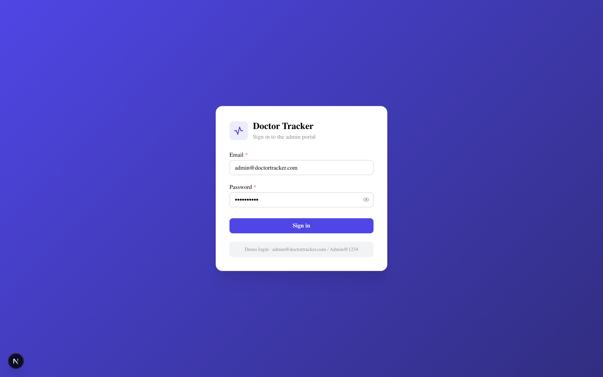
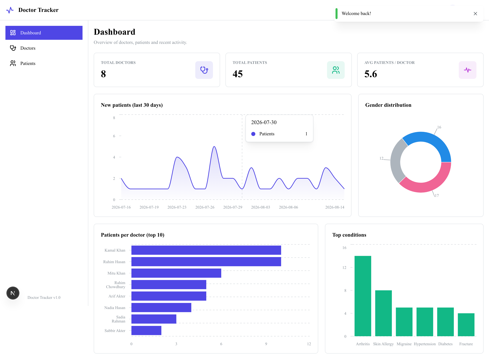
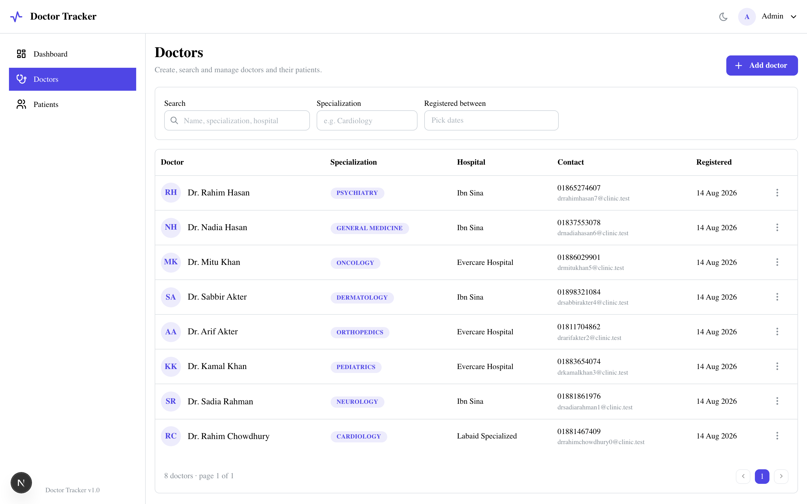
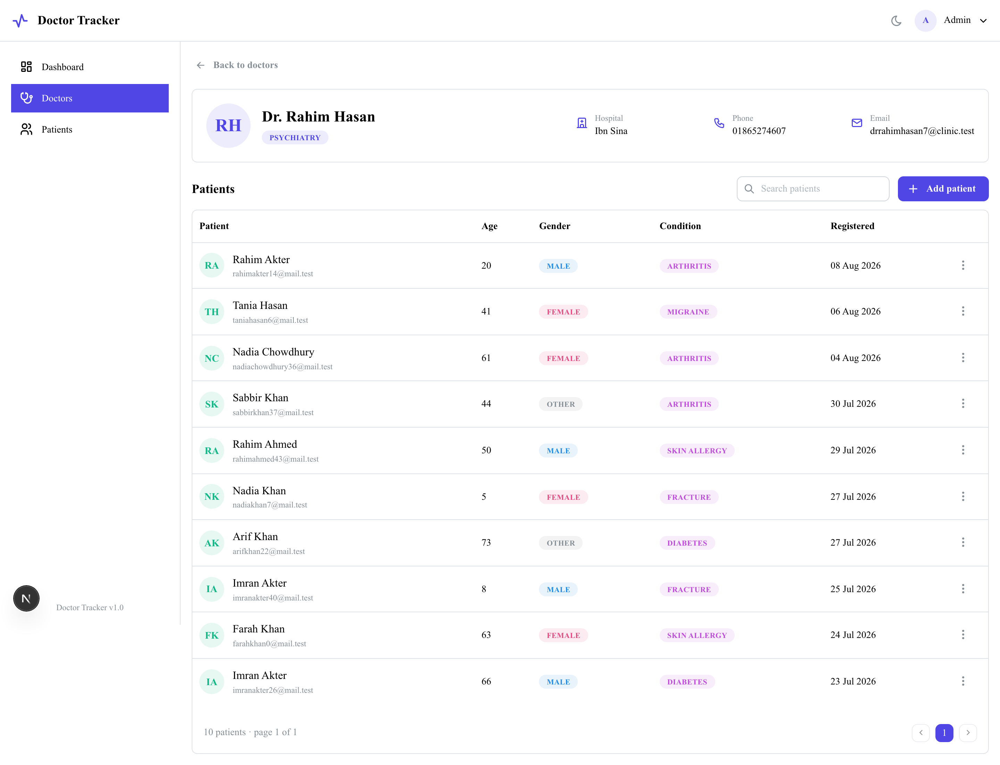
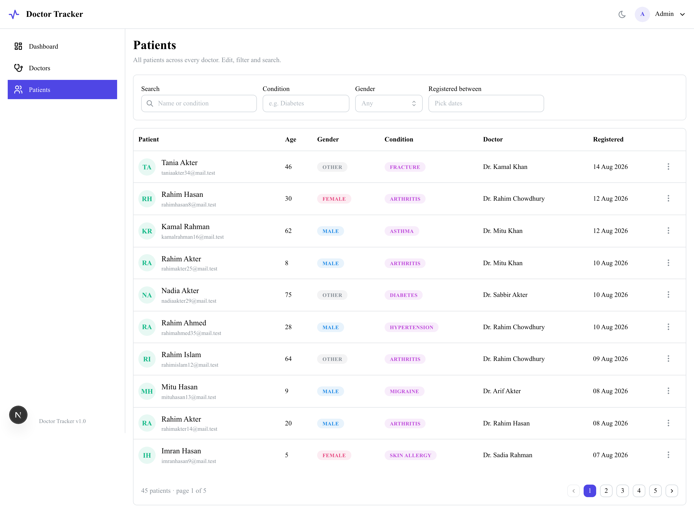
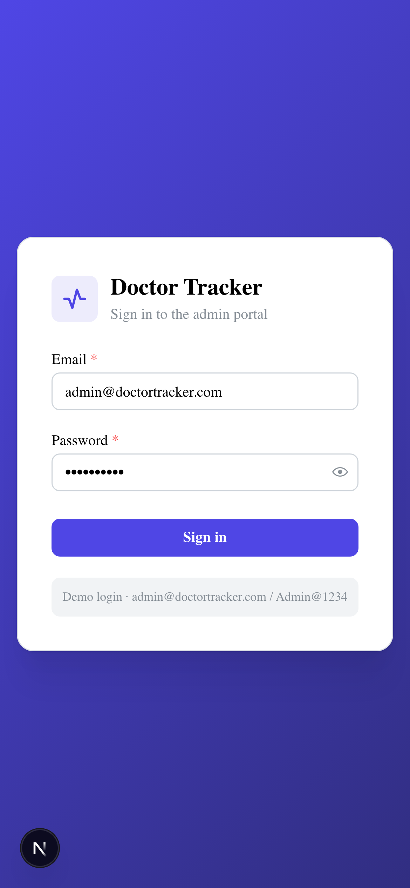
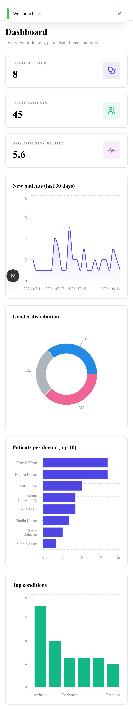
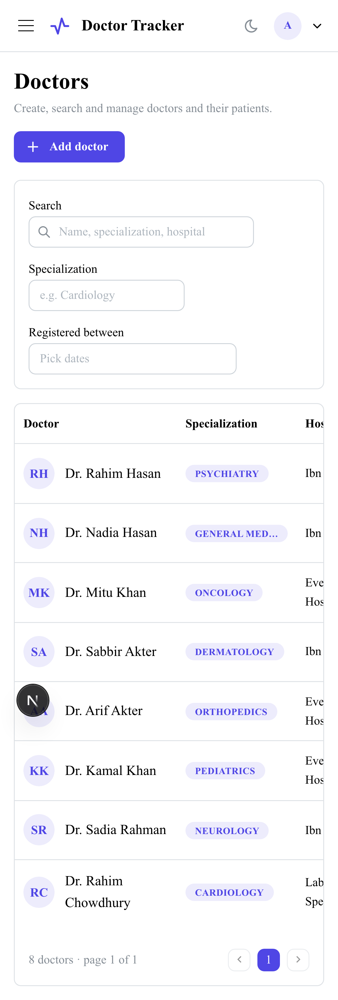

# Doctor Tracker — Frontend

A secure admin portal to manage doctors, their patients, and see meaningful analytics at a glance. This is the **frontend** (Next.js). It talks to a separate [Doctor Tracker backend](#) over a REST API.

> **Elevator pitch:** Doctor Tracker gives a clinic administrator one place to register doctors, manage each doctor's patients, and understand the practice through live charts — with authentication, fast search/filter/pagination, and a clean, responsive UI.

---

## Live demo

| | URL |
|---|---|
| Frontend (this app) | `https://<your-vercel-app>.vercel.app` |
| Backend API | `https://<your-render-app>.onrender.com/api` |

**Demo credentials**

```
Email:    admin@doctortracker.com
Password: Admin@1234
```

---

## Tech stack

- **Next.js 15** (App Router) + **React 19** + **TypeScript**
- **Mantine v8** — component library, theming, `AppShell` layout, `@mantine/charts`, `@mantine/form`
- **SWR** — server-state fetching, caching and revalidation
- **Zustand** — global auth/session state
- **Axios** — single HTTP instance with auth + error interceptors

> The stack (SWR + Zustand + Axios + Mantine) mirrors the conventions used across our other dashboards for consistency.

---

## Visual evidence

### Desktop

| Login | Dashboard |
|---|---|
|  |  |

| Doctors | Doctor detail (patients) |
|---|---|
|  |  |

| Patients |
|---|
|  |

### Mobile

| Login | Dashboard | Doctors |
|---|---|---|
|  |  |  |

---

## Setup guide

### Prerequisites
- Node.js 18+ and npm
- The [Doctor Tracker backend](#) running and reachable (locally or deployed)

### 1. Install
```bash
git clone https://github.com/Rafin000/doctor-tracker-frontend.git
cd doctor-tracker-frontend
npm install
```

### 2. Configure environment
Copy the example and point it at your API:
```bash
cp .env.example .env.local
```
`.env.example`:
```env
# Base URL of the Doctor Tracker API (NestJS backend). Include the /api prefix.
NEXT_PUBLIC_API_BASE_URL=http://localhost:4000/api
```
> `NEXT_PUBLIC_*` variables are inlined at **build time**, so set this before `npm run build` (and in your Vercel project's Environment Variables for production).

### 3. Run
```bash
npm run dev      # http://localhost:3000
```
Sign in with the demo credentials above.

### 4. Production build
```bash
npm run build && npm run start
```

---

## System architecture

Two independent apps communicating over REST:

```
┌─────────────────────────┐        HTTPS / REST         ┌──────────────────────────┐
│   Next.js frontend      │  ───────────────────────▶   │   NestJS backend (API)   │
│                         │   Authorization: Bearer     │                          │
│  Pages (App Router)     │                             │  Guards → Pipes →        │
│    │                    │   { success, data, meta }   │  Controllers → Services  │
│    ▼                    │  ◀───────────────────────   │  → Repositories          │
│  SWR hooks  ◀── Zustand │                             │        │                 │
│    │  (auth/session)    │                             │        ▼                 │
│    ▼                    │                             │     MongoDB (Mongoose)   │
│  Service layer          │                             └──────────────────────────┘
│    │                    │
│    ▼                    │
│  Axios instance         │
│  (interceptors)         │
└─────────────────────────┘
```

**Data flow (a list screen):**
1. A page holds UI state (search, filters, page) and debounces fast inputs.
2. It calls an **SWR hook** (e.g. `useDoctors(query)`) keyed by `[QUERY_KEYS.DOCTORS, query]`.
3. The hook calls a **Service** (`DoctorService.list`) which builds the URL and calls the **Axios instance**.
4. The axios **request interceptor** attaches the Bearer token; the **response** is unwrapped from the `{ data, meta }` envelope.
5. After a mutation, hooks call SWR's `mutate()` with a key-prefix matcher to **revalidate** every affected cache (list + dashboard) so the UI stays in sync.

**Auth flow:** login stores the JWT in a cookie; a Zustand store holds the resolved session; the protected `AppShell` layout bootstraps the session via `/auth/me` and redirects to `/login` if unauthenticated. A global 401 interceptor clears the token and bounces to login.

**Folder structure:**
```
src/
├── app/
│   ├── login/                     # public login page
│   └── (dashboard)/               # protected route group (AppShell + guard)
│       ├── dashboard/             # analytics + charts
│       ├── doctors/ , doctors/[id]/
│       └── patients/
├── components/  (common/ doctors/ patients/ layout/)
└── lib/
    ├── services/   # axios instance + per-domain Service objects
    ├── hooks/      # SWR hooks + mutations
    ├── stores/     # Zustand auth store
    ├── types.ts , constants.ts , theme.ts , config.ts
```

---

## Technical decisions

### 1. SWR + Zustand instead of Redux (or React Query)
Almost all of this app's state is **server state** (doctors, patients, analytics) — remote, cached, and needing revalidation, not hand-managed reducers. Putting that in Redux would mean a lot of boilerplate (actions, reducers, thunks, manual loading/error flags) to re-implement what a data-fetching library gives for free.

- **SWR** owns server state: caching, dedupe, `keepPreviousData` for smooth pagination, and targeted revalidation after mutations via a key-prefix `mutate()`.
- **Zustand** owns the small amount of genuine **client state** — the auth session — in ~15 lines, readable synchronously by the layout with no provider tree.

React Query would also work, but its heavier cache/devtools machinery is unnecessary here; SWR covers the read-heavy dashboard with far less surface area. The result is less code and a clear split: *SWR for the server, Zustand for the client.*

### 2. A typed Service layer over a single Axios instance
Rather than sprinkling `fetch`/`axios` calls through components, every request goes through **one axios instance** wrapped by a small **Service layer** (`DoctorService`, `PatientService`, …).

- The instance's **request interceptor** attaches the JWT and the **response path** unwraps the backend's `{ success, data, meta }` envelope into typed helpers (`getPage<T>`, `postData<T>`), so components receive clean domain objects.
- A single **401 interceptor** centralizes "session expired → clear token → redirect," so no component has to think about auth failures.
- Errors are normalized into one `ApiError` type, so every screen reports failures consistently.

This keeps components declarative (they call `useDoctors()`), makes the API surface easy to change in one place, and guarantees consistent auth/error behavior everywhere.

---

## Available scripts
```bash
npm run dev      # start dev server
npm run build    # production build (type-checked + linted)
npm run start    # serve the production build
npm run lint     # eslint
```
